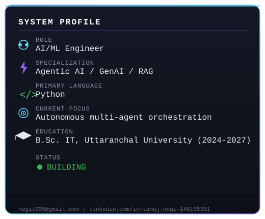
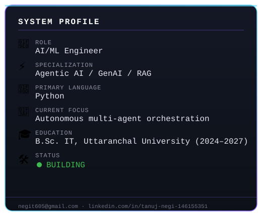
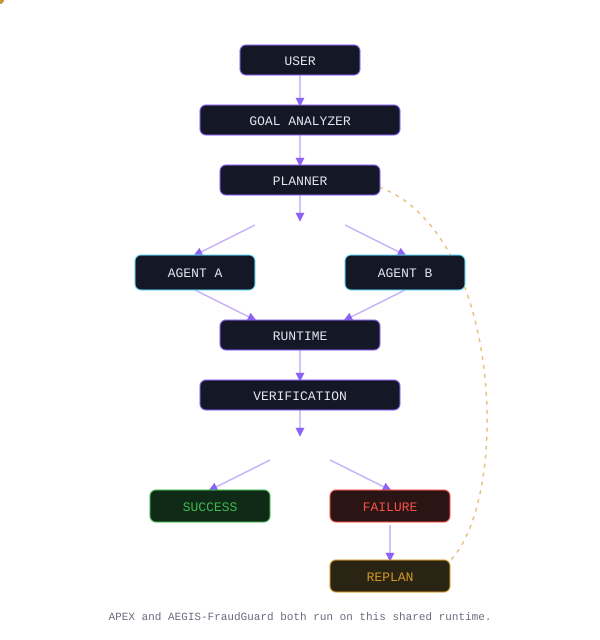
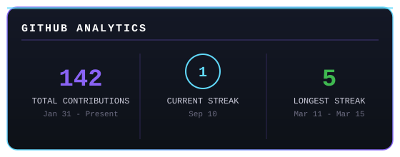

[new rep.md](https://github.com/user-attachments/files/32089316/new.rep.md)

 

## 🧠 System Profile

- 🔭 Currently building multi-agent orchestration platforms and RAG-powered assistants
- 🌱 Deepening skills in Agentic AI, LangChain ReAct agents, and structured LLM outputs
- 💼 Completed traineeships/internships at **IBM**, **Zidio Development**, and **IIT Roorkee × Masai** (Agentic AI Program)
- 📜 Certified in **Generative AI** (Infosys Springboard) and **MCP — Chief of Staff** (Masai Live Workshop)
- 📫 Reach me at **negit605@gmail.com**

 

## ◉ AI Core

 

## 🚀 Featured Systems

<table>
<tr>
<td width="50%" valign="top">

**APEX** — Autonomous VMware Predictive Execution

Multi-agent orchestration platform on a custom **AEGIS-Runtime** engine — FastAPI backend, React/TypeScript "Signal Deck" UI, Gemini-powered reasoning, WebSocket streaming.

`Python` `FastAPI` `React` `TypeScript` `Gemini`

[**Source**](https://github.com/tanuj1718vi/APEX)

</td>
<td width="50%" valign="top">

**AEGIS-FraudGuard**

Fraud-detection system built on the AEGIS-Runtime engine — goal-driven agents with verification and replan loops.

`Python` `AEGIS-Runtime`

[**Source**](https://github.com/tanuj1718vi/AEGIS-FraudGuard)

</td>
</tr>
<tr>
<td width="50%" valign="top">

**FORESIGHT**

Predictive intelligence system — early-stage build.

`HTML` `Python`

[**Source**](https://github.com/tanuj1718vi/FORESIGHT)

</td>
<td width="50%" valign="top">

**GoviCheck**

Civic transparency platform — anonymous polls, parliament data, budget tracking. Built as a single-file app for a student presentation.

`HTML` `JavaScript` `localStorage`

[**Source**](https://github.com/tanuj1718vi/GoviCheck)

</td>
</tr>
<tr>
<td width="50%" valign="top">

**The Draft Desk**

Gmail-integrated AI email drafting workflow powered by Gemini + Streamlit.

`Python` `Streamlit` `Gmail API` `Gemini`

[**Source**](https://github.com/tanuj1718vi/The-Draft-Desk)

</td>
<td width="50%" valign="top">

**SIM Network Detector**

Network analysis tool for SIM-based connectivity detection.

`Python`

[**Source**](https://github.com/tanuj1718vi/SIM-Network-Detector)

</td>
</tr>
</table>

 

## 🏗️ Architecture — AEGIS-Runtime

 

## 🛠️ Tech Arsenal

**AI / ML**

**Backend**

**Frontend**

**Tools**

 

## 📊 GitHub Analytics

 

## 🐍 Contribution Snake

 

## 🏆 Achievements

 

## 🤝 Let's Connect

